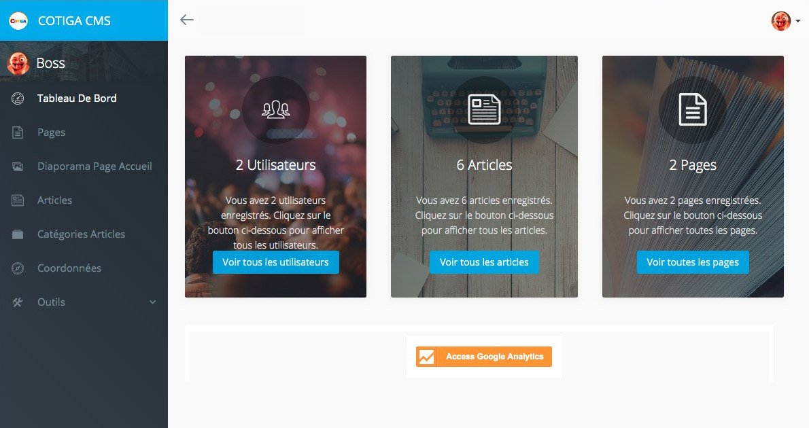

# CMS COTIGA

### description: Guide d'utilisation du CMS COTIGA

## CMS COTIGA

La solution CMS de COTIGA utilise le Framework CSS Bootstrap et est hébergée sur des serveurs LTS de dernières générations avec les technologies Nginx, PHP et MySQL. Ces technologies sont constamment mises à jours dans leurs dernières versions stables. Vous n'avez pas à vous soucier de la sécurité et de l'obsolescence de votre CMS COTIGA.

En utilisant le CMS COTIGA, vous bénéficiez :

* d’une interface de gestion du contenu de pages statiques
* de la création d’articles avec leurs catégories
* d'une gestion d'images simplifiée
* de la modification des coordonnées de votre établissement
* de fonctionnalités développées sur mesure selon vos souhaits

Tout cela de la manière la plus ergonomique et intuitive possible.

