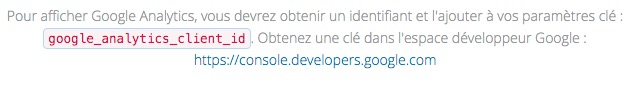

# Analytics

L'intégration de Google Analytics est fournie par défaut.  
Il s'agit d'un module fournie par Google enregistrant les visites sur votre site avec des informations de type : provenance, profil, matériel utilisé... des visiteurs.  
Si ce service ne vous intéresse pas, nous le mentionner par mail, nous le désactiveront.

L'usage de ce module en Europe, nécessite de se conformer à la législation concernant la protection des données et respect de la vie privée en ligne \(Loi "[RGPD](https://europa.eu/youreurope/citizens/consumers/internet-telecoms/data-protection-online-privacy/index_fr.htm)"\). COTIGA se chargera des démarches et de la mise en conformité si mise à disposition du mandataire des informations nécessaires.

Sur la page d'accueil de votre espace d'administration, s'affiche :

Cliquez sur \[ Access Google Analytics \] et connectez vous avec l'adresse mail renseignez auprès du service Google.  
COTIGA fait le nécessaire auprès de Google pour ajouter et valider votre adresse mail, si ce n'est pas le cas ou si vous ne voyez pas l'icône ci-dessus, mais le contenu de l'image ci-dessous ou une case blanche, contactez nous !

