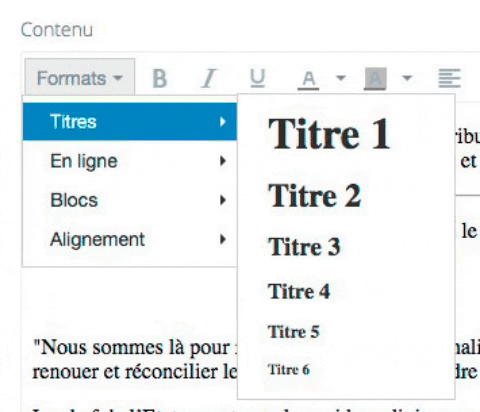
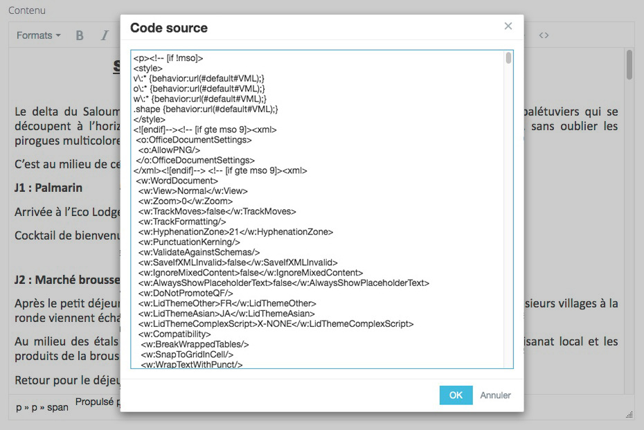
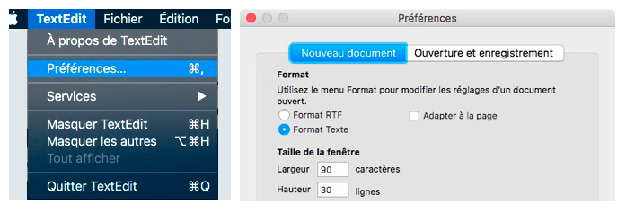
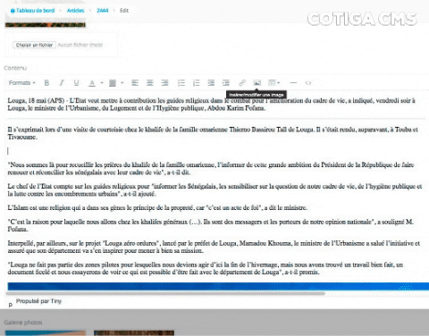
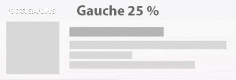
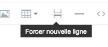
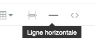
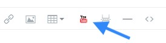

# Editeur de contenu \(champ texte riche\)

## Règles de bon usage du champ "texte riche"

### _Pour un bon référencement et un site au top_

Dans l'édition du contenu de vos pages, articles ou autre, le champ de contenu est le plus important.  
Ce champ utilise le logiciel d'édition javascript TinyMCE.  
Nous lui avons apporté des modifications afin qu'il soit le plus complet et le plus intuitif possible.

Sous le bouton "Formats" vous trouverez différents sous-menus. Rien de compliqué, il s'agit comme dans la majorité des logiciels de traitement de texte, des fonctionnalités de base.

### Erreur à ne pas commettre !

Une erreur souvent commise et qui pénalise le succès de votre site, est de copier/coller du texte issu de Word par exemple. En collant directement ce texte dans votre site, vous y ajoutez tout le code \(invisible\) de mise en forme généré par Word. Cela est aussi le cas lorsque vous copiez/collez du texte pris sur un autre site Internet, depuis un PDF...

L'exemple ci-dessous est issu du copié/collé d'un fichier Word de 2 pages standards sans mise en forme complexe.  
Cela a généré 973 lignes de code, en grande majorité inutiles. Ce code sera stocké en base de données, ralentira le transfert sur l'internet et peut provoquer des conflits avec le code HTML du site.

#### La solution

**Passer par un éditeur de texte .txt** _\(non riche tel .rtf, .doc, ...\)_.

Pour supprimer tout le formatage indésirable :

* collez le texte issu de Word, d'un PDF, d'un site Internet... dans Bloc Note \(ou équivalent, voir ci-dessous\)  
* sélectionnez le texte du Bloc Note _\(Ctrl + A\)_ et copiez-le _\(Ctrl + C\)_  
* vous pouvez maintenant le coller _\(Ctrl + V\)_ dans l'éditeur du site, il ne présentera aucune mise en forme, hormis des paragraphes.  
* utilisez les outils de l'éditeur présent dans le site pour mettre en forme votre publication  

**Editeurs .txt**

Sous **Windows** utilisez "**Bloc Note**", il est idéal pour l'édition de texte pur, sans mise en forme possible.

Sous **Mac** vous disposez de "TextEdit" , mais il faut modifier ses préférences pour qu'il utilise le format .txt par défaut.  
_\*\*_Pour cela, ouvrez les préférences et cochez "Format texte" au lieu de "Format RTF"

## Insertion image

Pour un bon référencement, privilégiez l'usage d'images au format JPG !

Là où nous avons apporté le plus d'améliorations, est sur l'insertion des images.

L'image sera placée à la position de votre curseur.  
Après avoir cliquez sur l'icône d'insertion d'image, cliquez sur l'icône "dossier + loupe" qui ouvrira la boite de dialogue "explorateur de fichier".  
Une fois le fichier image choisi et ajouté, vous pouvez renseigner le champ "Description de l'image" utile aux moteurs de recherche et donc au bon référencement de votre site.

### **Le menu déroulant "Classe"**

Il contient les options de dimension et d'alignement des images.

Par défaut, **100%  
L**'image occupera toute la largeur.

Les options **25, 33, 50 et 75 %** afficheront les images au pourcentage indiqué par rapport à la largeur du bloc contenant le texte \(le rendu ne sera pas visible dans l'éditeur, il faudra enregistrer et visualiser le résultat sur le site\).  
Ces options de pourcentage ont la particularité de pouvoir mettre plusieurs images sur une même ligne \(à condition que le total ne dépasse pas 100%\).

**Astuce** pour centrer plusieurs images occupant moins de 100% de largeur \(exemple : 2 images à 25%\), placez le curseur à une extrémité des images \(sans qu'une image ne soit sélectionnée\) et cliquez sur l'icône "Centrer" \(centrer le texte\).

Les options "**Centrée 50 et Centrée 75 %**" afficheront l'image sur une ligne et centrée. Rien ne s'affichera sur les cotés de l'image.

Les options "**A gauche 25%, 33% et 50%**" et "**A droite 25%, 33% et 50%**" afficheront l'image au pourcentage choisi à coté du texte \(démo sur figure ci-dessous\).

## Forcer une nouvelle ligne

Très utile lorsque les bloc de texte lié à des images se chevauchent.  
Placez votre curseur à la fin d'un paragraphe et cliquez sur le bouton "**Forcer nouvelle ligne**".  
Cette action forcera le contenu situé en dessous du paragraphe d'occuper la totalité de la largeur disponible \(et donc de ne plus chevaucher le contenu situé au-dessus\).

**Bon à savoir**, le comportement est identique avec l'insertion d'une barre horizontal _\(descriptif ci-dessous\)_, mais sans l'ajout du trait.

## La barre horizontale

Elle affichera une fine ligne horizontale grise claire. Elle occupera 100% de la largeur du bloc et séparera le contenu supérieur de l'inférieur \(utile afin qu'une image ne se superpose ou n'empiète un nouveau paragraphe par exemple\)

## Insertion vidéo Youtube

Nous avons conçu un module aussi simple que possible pour insérer des vidéos Youtube dans vos pages. Vous n'avez qu'à renseigner l'URL ou le lien de partage de la vidéo et cliquer \[ Insérer la vidéo \] La vidéo sera "responsive" et sera insérée là où est positionné votre curseur.

## Pour finir

N'oubliez pas d'enregistrer l'ajout ou la modification de votre contenu via le bouton bleu \[ Enregistrer \] en bas de page

Rien ne vaut la pratique pour assimiler le fonctionnement de cet outil, que nous espérons avoir simplifiez au maximum pour un usage aisé.

