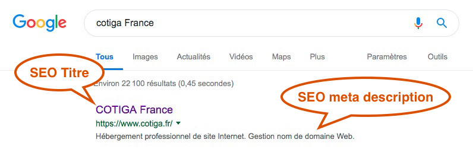
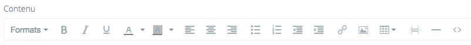

# SEO \(référencement\)

## Pages

Votre page d'accueil et les pages statiques disposent de champs SEO.  
Ils sont au nombres de 2 :

* SEO titre
* SEO description

Ces champs renseignent les balises HTML "title" et "meta description" dont les renseignements sont indispensables pour le bon référencement de votre site Internet.

Le contenu de ces balises n'apparaissent pas dans le contenu visible de votre site Internet, mais vous pouvez le voir dans le résultat de recherche.  
Google en exemple ci-dessous

## Articles, produits...

Le contenu dynamique des articles, produits, ... \(suivant les options souscrites\) renseignera automatiquement les balises SEO avec un algorithme optimisé.

Pour un référencement optimal et une bonne performance de votre site, il est conseiller de ne pas copier/coller du contenu depuis un site Internet tierce ou d'un document Word, PDF ... dans les champs contenu \(éditeur de texte riche\).

Cela à pour effet d'alourdir le site, parfois de milliers de lignes de code invisible, mais pourtant existant et devant transiter sur le réseau et être interprété par le navigateur du visiteur.  
Plus d'info et la technique à suivre sur la page :  
[https://doc.cotiga.fr/documentation/contenu-champ-texte-riche](https://doc.cotiga.fr/documentation/contenu-champ-texte-riche)

## Renommage de vos fichiers

Pour un référencement optimal, le nom de fichier \(image, pdf, ...\) est important.

Le site dispose d'un algorithme de conservation de votre nom de fichier, si celui ci répond aux exigences de l'Internet \(caractères alpha-numérique uniquement et pas d'espaces\). Si le nom de fichier ne respecte pas le standard du Web, le système de téléchargement se chargera de renommer votre fichier par un nom aléatoire.

Pour le succès de votre site, merci de nommer correctement vos fichiers avant de les ajouter sur le site.

Exemple de noms de fichier OK

* ma-belle-photo-de-vacances.jpg
* la-documentation-fr.pdf
* the-documentation-en.pdf
* a-la-facon-senegalaise.jpg

Exemple de mauvais noms

* Ma belle\_Phot de Vacances.jpg
* La\_documentation FR.pdf
* The Eng\_Documentation.pdf
* à-la-facon-Sénégalaise.jpg

Pour info et optimisation, il est aujourd'hui conseillé de se servir de plateformes dites Cloud pour héberger et partager vos fichiers volumineux \(vidéos, gros PDF, ...\). Ces services vous permettent en générales de crée des liens de partage.  
Liens que vous pourrez intégrer avec l'éditeur de contenu _\(_[_champ texte riche_](https://doc.cotiga.fr/documentation/contenu-champ-texte-riche)_\)_.

### CONSEIL

Préférez le format d'image JPG au PNG. Le PNG est beaucoup plus "lourd" et pénalisera la rapidité d'affichage de votre site.

