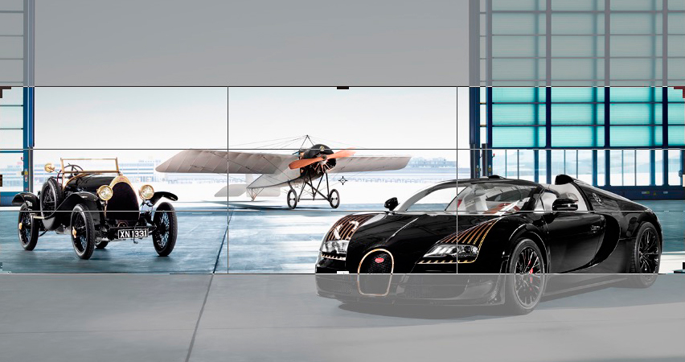

# Diaporama

La dimension des images du diaporama est selon la charte graphique du site.

Elle sont généralement aux alentours de :  
1680 pixels de large sur 550 pixels de hauteur  

Lorsque vous ajoutez des images aux diaporamas, elle seront automatiquement redimensionnées aux valeurs prédéfinies de votre site. Le rognage verticale se fera à parts égales sur le haut et le bas de l'image, prévoyez donc des images se prêtant à se découpage dans la hauteur.

*Exemple de résultat, la partie net sera celle conservée après le redimensionnemment et le rognage de l'image.*

Prévoyez aussi une image assez large, sans cela elle sera étirée avec pour conséquence une perte de qualité.
